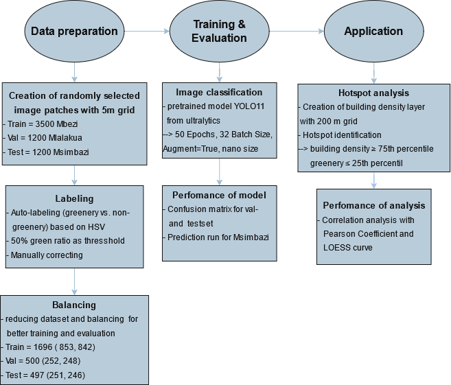
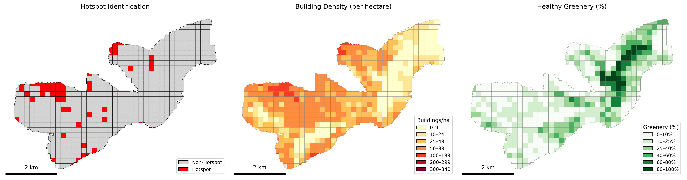

# Quantifying Urban Greenery in Dar es Salaam Using YOLO11 and UAV imagery

* This project contains an deep learning approach for the detection of urban "healthy greenery". The model is based on the YOLO11 classification model `yolo11n-cls.pt`, which is pretrained on ImageNet and additionally trained with image patches from drone footage of Dar es Salaam. In this repo three notebooks, environment and datasets are provided, as needed to run the code itself.

## Motivation and General Information

* Urban green spaces play a vital role in rapidly growing cities with numerous slums, such as Dar es Salaam, Tanzania. "Healthy Greenery" helps to improve air quality and lower temperatures in hot regions. While manual mapping is inefficient and time-consuming, a deep learning process can help automate the process and efficiently monitor greenery development. This can be helpful for sustainable urban development.

* This model is trained to detect only truly green greenery. Brown meadows, for example, are therefore not detected. This simplified approach of distinguishing between greenery and non-greenery ensures a high accuracy of over 95%. For more complex analyses, the model would need to be adapted with an additional class, such as semi-green areas.

## Getting started

* The code is entirely contained in a Jupyter notebook and was developed with Python in VS Code. The working environment is managed with a python environment venv, and the complete environment configuration is provided as txt file for easy reproducibility.

### Dependencies

Before running the notebook, you need to have:
- Python 3.11.*
- JupyterLab or Jupyter Notebook
- The required packages listed in the `requirements.txt`

### Installing and executing programm

1. Creation of virtual environment
    ```bash
    python -m venv venv
    ```
2. Activation with PowerShell
    ```bash
    venv/Scripts/activate
    ```
   or Activation with macOS / Linux
    ```bash
    source .venv/bin/activate
    ```
3. Install packages
    ```bash
    pip install -r requirements.txt
    ```
4. Open the Jupyter Notebook in VS Code or JupyterLab and select right kernel (venv) and run all cells 

## Data source and license

*  input data stored in folder (only stored locally and not on github, because datasets are too large)<br>
locally stored under data/raw/

* the grid for patch creation was created with QGIS: <br>locally stored under data/grid/

**Download Data:** [Heibox link](https://heibox.uni-heidelberg.de/d/056a33f61b324da68181/)

**License from YOLO11:** [](https://opensource.org/license/agpl-v3)

### Workflow



### Results




## References


