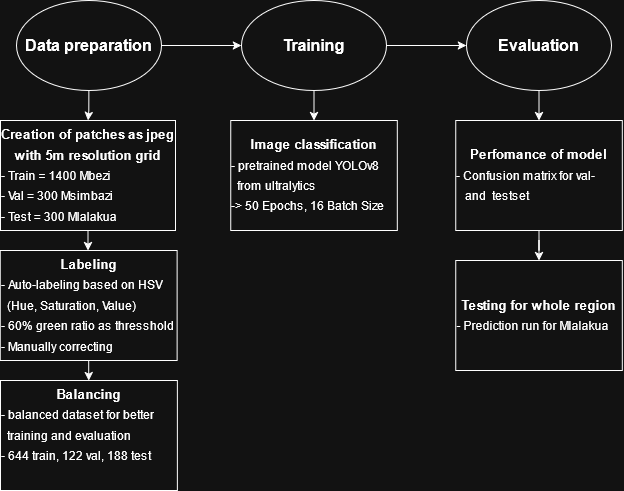

# GeoAI_and_DL
### GeoAI and Deep Learning Seminar

* input data is downloadable under https://heibox.uni-heidelberg.de/d/056a33f61b324da68181/

*  input data stored in folder (only stored locally and not on github, because datasets are too large)<br>
locally stored under data/raw/


* the grid for patch creation was created with QGIS: <br>locally stored under data/grid/

### Creation of virtual environment
```bash
python -m venv venv
```
### Activation with PowerShell
```bash
venv/Scripts/activate
```
### Install packages
```bash
pip install -r requirements.txt
```

### Code organization with branches

* `main` for stable code and merging from dev
* `dev`  for development and merging from testing branches
* `testing` for own testing

### Workflow




